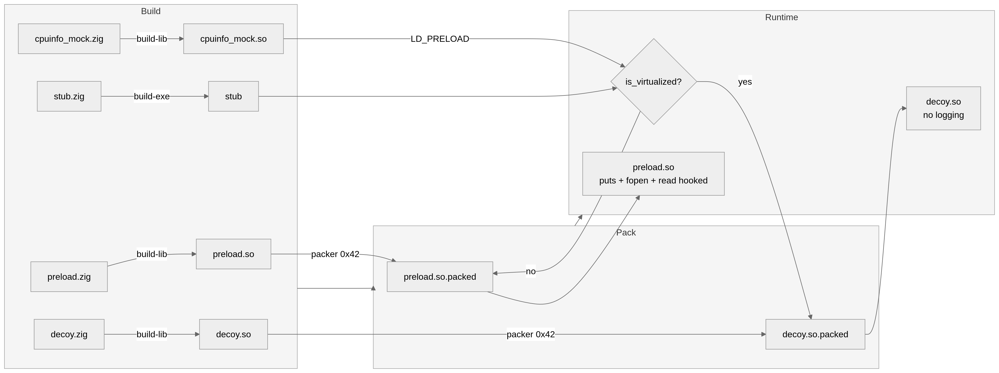

# ld-preload-hook-poc

Proof-of-concept pipeline for LD_PRELOAD-based libc function hooking, XOR packing, fileless loading, and YARA-based detection. Built with Zig targeting Linux x86_64.

## Components

| File | Role |
|---|---|
| `preload.zig` | Shared library hooking `puts`, `fopen`, `read` via `RTLD_NEXT` |
| `packer.zig` | XOR encrypt/decrypt a binary file |
| `stub.zig` | Decrypt packed payload into anonymous memory and load via `memfd_create` + `dlopen` |
| `decoy.zig` | Inert shared library exporting the same symbols without any logging |
| `cpuinfo_mock.zig` | Shared library intercepting `fopen("/proc/cpuinfo")` to inject a fake "hypervisor" flag |

## Build

All components use a single compile command, no `build.zig`.

```sh
# Hook library
zig build-lib preload.zig -dynamic -lc -ldl -target x86_64-linux-gnu -O ReleaseSafe -femit-bin=preload.so

# Decoy library
zig build-lib decoy.zig -dynamic -lc -ldl -target x86_64-linux-gnu -O ReleaseSafe -femit-bin=decoy.so

# cpuinfo mock
zig build-lib cpuinfo_mock.zig -dynamic -lc -ldl -target x86_64-linux-gnu -O ReleaseSafe -femit-bin=cpuinfo_mock.so

# Packer
zig build-exe packer.zig -lc -target x86_64-linux-gnu -O ReleaseSafe -femit-bin=packer

# Stub loader
zig build-exe stub.zig -lc -ldl -target x86_64-linux-gnu -O ReleaseSafe -femit-bin=stub

```

## Usage

### Pack payloads

```sh
./packer preload.so preload.so.packed 0x42
./packer decoy.so decoy.so.packed 0x42
```

### Run stub

```sh
# Bare metal path - loads preload.so.packed
./stub

# Simulated VM path - loads decoy.so.packed
LD_PRELOAD=./cpuinfo_mock.so ./stub
```

### Verify hook

```sh
# Observe hook log on stderr
LD_PRELOAD=./preload.so python3 -c "import ctypes; ctypes.CDLL(None).puts(b'test')"

# Check exported symbols
nm -D preload.so | grep -E "puts|fopen|read"
```

## Test

```sh
bash test_harness.sh
```

Expected output:

```
=== Test 1: VM environment (expect decoy) ===
[STUB] VM detected - loading decoy
Loaded successfully
Exit: 0

=== Test 2: Bare metal (expect payload) ===
[STUB] Bare metal - loading payload
Loaded successfully
Exit: 0
```

## Detection

Three YARA rule files cover the full pipeline:

| File | Detects |
|---|---|
| `detect_preload_hook.yar` | `RTLD_NEXT` usage, `puts+fopen+read` export trio, `[HOOKED]` log strings |
| `detect_fileless_loader.yar` | `memfd_create` syscall + `/proc/self/fd/` pattern, high-entropy ELF sections, packed blobs |
| `detect_vm_aware.yar` | `/proc/cpuinfo` + `hypervisor` read pattern, dual packed payload paths |

```sh
yara -r detect_preload_hook.yar preload.so
yara -r detect_fileless_loader.yar stub
yara -r detect_vm_aware.yar stub
```

## Pipeline Overview


